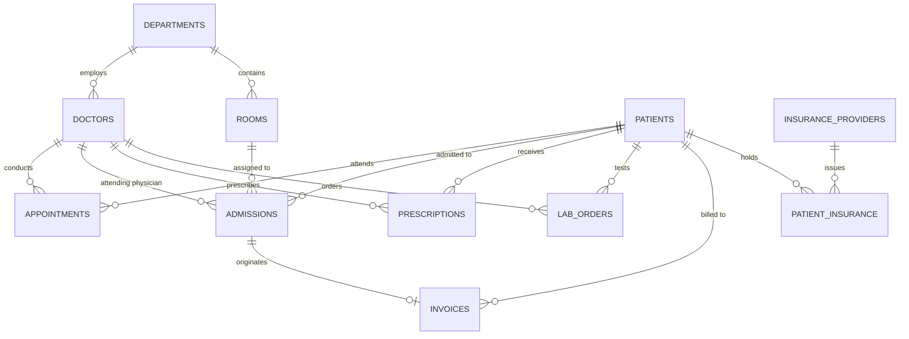
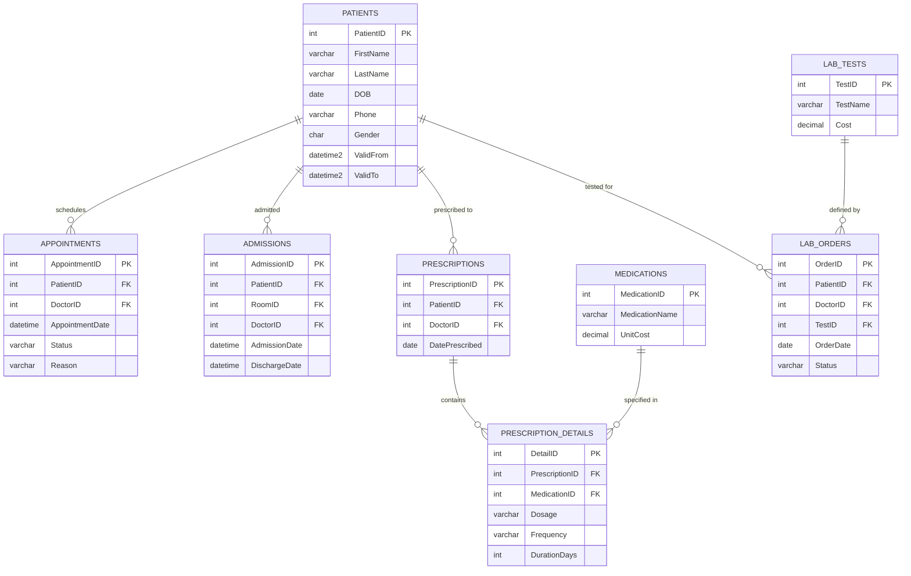
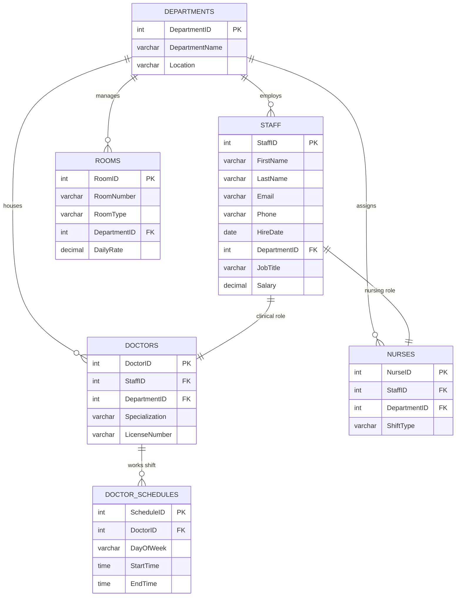
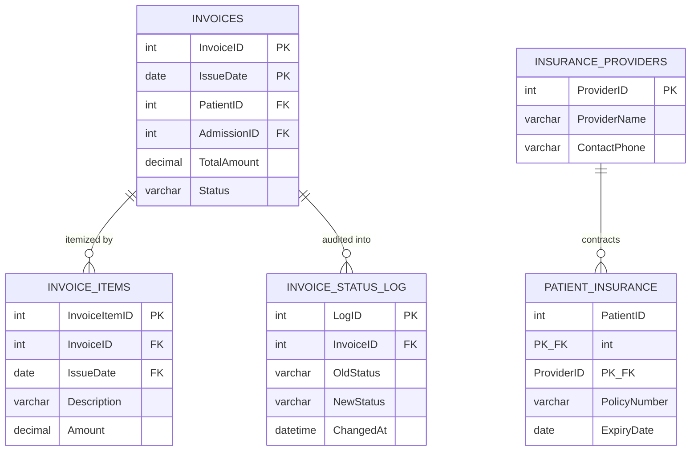

# Hospital Management System (HMS) - Entity Relationship Diagrams

To ensure maximum clarity and readability on GitHub, the database architecture is presented through **focused domain diagrams** alongside an **executive high-level overview**.

---

## 1. Executive System Overview (Core Relationships)

A clear, uncrowded architectural view showing how the three core business domains interconnect:

---

## 2. Clinical Care Domain (`clinical` Schema)

Details the patient lifecycle, admissions, appointments, prescription details, and laboratory diagnostics:

---

## 3. Human Resources & Hospital Facilities (`hr` Schema)

Details staff management, medical specialists, shift rosters, and patient rooms:

---

## 4. Billing, Insurance & Audit Domain (`billing` Schema)

Details partitioned invoices, line items, patient insurance policies, and status change audit logs:

---
