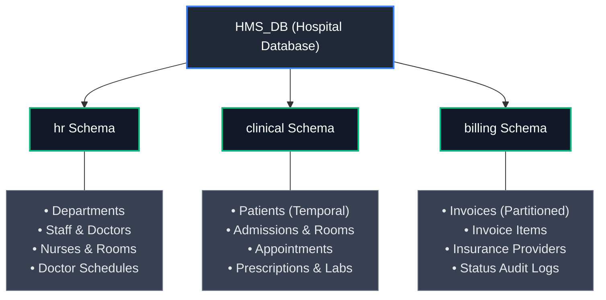

# Hospital Management System Database (HMS_DB)

[](#)
[](#)
[](#)
[](#)

A comprehensive, production-grade enterprise relational database designed for **Hospital Information Systems (HIS)**. Engineered with SQL Server 2022 (Compatibility Level 160), incorporating schema domain segregation, system-versioned temporal tables, horizontal table partitioning, transactional stored procedures, and audit triggers.

---

## Database Architecture & Schemas

The database structure is modularized into three core business domains:



---

## Repository Structure

```text
HMS-Database/
│
├── Database/
│   ├── 01_Schemas.sql              # Database context, roles, schemas, partition functions
│   ├── 02_Tables.sql               # Base table definitions, PKs, and temporal tables
│   ├── 03_Constraints.sql          # Defaults, checks, and foreign key integrity constraints
│   ├── 04_Indexes.sql              # Non-clustered, filtered, and unique indexes
│   ├── 05_Sequences.sql            # Sequence generators (billing.InvoiceRefSeq)
│   ├── 06_Views.sql                # Doctor workload, patient history, invoice totals
│   ├── 07_Functions.sql            # Patient age scalar UDF & doctor appointments TVF
│   ├── 08_StoredProcedures.sql     # Admission billing, reports, patient admission
│   ├── 09_Triggers.sql             # Anti-overbooking & invoice status audit triggers
│   └── 10_SeedData.sql             # Realistic sample seed data for all domains
│
├── ERD/
│   └── README.md                   # Interactive Mermaid entity-relationship diagrams
│
├── Queries/
│   ├── BasicQueries.sql            # Daily operational queries (schedules, lookups)
│   ├── AdvancedQueries.sql         # Temporal queries, window functions, CTEs
│   └── Reports.sql                 # Executive financial, bed occupancy, diagnostic reports
│
├── HMS_DB.sql                      # Monolithic consolidated export (legacy reference)
├── README.md                       # Comprehensive repository documentation
└── .gitignore                      # Git ignore rules for SQL Server and IDE files
```

---

## Entity Relationship Diagrams (ERD)

Detailed domain diagrams with table attributes and primary/foreign keys are maintained in the [ERD Documentation](ERD/README.md).

---

## Deployment & Installation Guide

To deploy `HMS_DB` from source, execute the scripts sequentially in SQL Server Management Studio (SSMS), Azure Data Studio, or via `sqlcmd`:

```bash
# Sequential deployment using sqlcmd
sqlcmd -S <server_instance> -E -i Database/01_Schemas.sql
sqlcmd -S <server_instance> -E -i Database/02_Tables.sql
sqlcmd -S <server_instance> -E -i Database/03_Constraints.sql
sqlcmd -S <server_instance> -E -i Database/04_Indexes.sql
sqlcmd -S <server_instance> -E -i Database/05_Sequences.sql
sqlcmd -S <server_instance> -E -i Database/06_Views.sql
sqlcmd -S <server_instance> -E -i Database/07_Functions.sql
sqlcmd -S <server_instance> -E -i Database/08_StoredProcedures.sql
sqlcmd -S <server_instance> -E -i Database/09_Triggers.sql
sqlcmd -S <server_instance> -E -i Database/10_SeedData.sql
```

---

## Key Engineering Features

### 1. System-Versioned Temporal Tables (`clinical.Patients`)
- Maintains an automated, tamper-proof history of patient profile changes in `clinical.Patients_History`.
- Enables point-in-time recovery and historical auditing via `FOR SYSTEM_TIME AS OF` and `FOR SYSTEM_TIME ALL`.

### 2. Horizontal Table Partitioning (`billing.Invoices`)
- Implemented with Partition Function `PF_InvoiceYear` and Partition Scheme `PS_InvoiceYear`.
- Segregates invoice records across annual partition boundaries (2024, 2025, 2026, 2027+) for optimal I/O performance.

### 3. Business Logic & Concurrency Protection
- **`clinical.trg_PreventOverbooking`**: Prevents double-booking a physician at identical appointment timestamps.
- **`billing.trg_LogInvoiceStatusChange`**: Automatically captures timestamped status changes into `billing.InvoiceStatusLog`.
- **`clinical.sp_AdmitPatient`**: Atomic transaction orchestrating room validation and inpatient record creation.

### 4. Advanced Analytics & Reporting
- Comprehensive query suites in `Queries/` covering running totals, department workload rankings, and bed occupancy rates.

---

## License
This project is open-source and licensed under the [MIT License](LICENSE).
